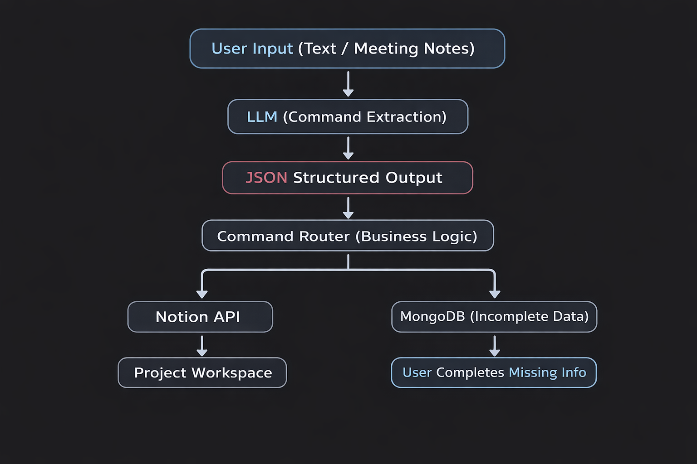

# AI-Powered Project Management Assistant

An intelligent project management web application that transforms natural language and meeting notes into structured tasks, projects, and sprints. The system uses Large Language Models (LLMs) to understand user input and automatically synchronize actions with Notion.

This project bridges unstructured human communication and structured project management workflows.

---

## Features

### Natural Language Commands
Create, update, consult, or delete tasks, projects, and sprints using plain text.

### Meeting Minutes Processing
Upload full meeting notes and automatically extract actionable items.

### AI-Powered Structuring
LLM converts text into structured JSON commands.

### Automatic Notion Sync
Tasks, projects, and sprints are created or updated directly in Notion.

### Human-in-the-Loop Completion
Incomplete AI-detected items are stored and later completed through the the web interface.

### Automatic Meeting Summaries
Generates clean summaries of discussions and decisions.

### Full CRUD Operations
Manage projects, tasks, and sprints from the web app.

---

## Architecture Overview

### System Architecture Diagram

> Place your architecture image inside a folder like `/docs` and update the path if needed.



### Backend
- FastAPI  
- Python  

### AI Layer
- OpenAI API (LLM for text → structured commands)

### Database
- MongoDB (stores incomplete or pending items)

### Integrations
- Notion API (project/task management)

### Frontend
- Jinja2 Templates  
- HTML/CSS (served via FastAPI)

---

## Main Components

| Module        | Responsibility |
|--------------|----------------|
| main.py      | FastAPI app, routes, frontend rendering |
| llm.py       | AI processing (command extraction, minute parsing, summarization) |
| notion.py    | Wrapper for Notion API operations |
| config/db.py | MongoDB connection |
| schemas.py   | Data formatting for frontend rendering |

---

## How It Works

### 1. Natural Language Command

User writes:

> "Create a high priority task for Ana to finish the login system by Friday"

The system:
- Sends text to the LLM  
- Converts it into structured JSON  
- Executes the action in Notion  

---

### 2. Meeting Minutes Processing

User submits a full meeting transcript.

The system:
- Extracts tasks, projects, and sprint updates  
- Executes complete items automatically  
- Stores incomplete items in MongoDB  
- Allows the user to complete missing details via the UI  

---

### 3. Meeting Summary

The AI generates a concise summary including:
- Assigned tasks  
- Deadlines  
- Project decisions  

---

## Installation

```bash
git clone https://github.com/Chris-VS02/AGENT-LLM.git
cd ai-project-manager
pip install -r requirements.txt

